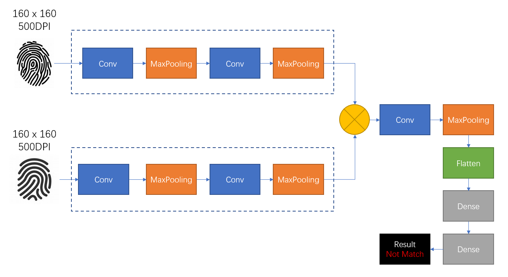

# Fingerprint_TF
Fingerprint recognition using Tensorflow2.

### Image Information
    Fingerprint image size is 160x160(500DPI).

### Environment
    Python : 3.7

    Tensorflow : >= 2.0

### Reference
    https://github.com/kairess/fingerprint_recognition

### Sample Dataset
You can get sample dataset from here.

    URL : https://pan.baidu.com/s/1N-Q7CJ1OMSF69XSrUwoOjA
    Password : w2k4

This dataset was created from FVC2000_DB4_B.

### Pretrained Model
Coming soon.

## Preprocess

Before you train model, you must do preprocess.

Preprocess can generate numpy data from original image.

Please see dataset/README.md file.

## Train

You can train your model using source/02_train source.

### Model Structure

## Evaluation

You can evaluate your model using source/03_evaluation source. 

## Donate
Please donate fingerprint image dataset for research purpose.

Thanks.
